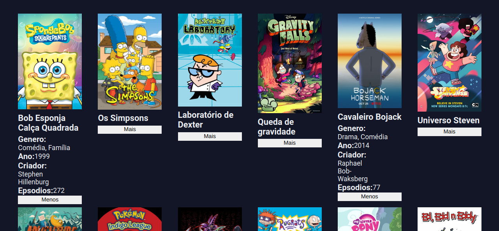

<div align="center" id="top"> 
  

  &#xa0;

  <!-- <a href="https://frontend_daz_da_onesight.netlify.app">Demo</a> -->
</div>

<h1 align="center">Teste para vaga Frontend DAZ da Onesight</h1>

<p align="center">
  

  

  

  

  <!--  -->

  <!--  -->

  <!--  -->
</p>

<!-- Status -->

<!-- <h4 align="center"> 
	🚧  Frontend_DAZ_da_Onesight 🚀 Under construction...  🚧
</h4> 

<hr> -->

<p align="center">
  <a href="#dart-about">About</a> &#xa0; | &#xa0; 
  <a href="#rocket-technologies">Technologies</a> &#xa0; | &#xa0;
  <a href="#white_check_mark-requirements">Requirements</a> &#xa0; | &#xa0;
  <a href="#checkered_flag-starting">Starting</a> &#xa0; | &#xa0;
  <a href="#memo-license">License</a> &#xa0; | &#xa0;
  <a href="https://github.com/{{YOUR_GITHUB_USERNAME}}" target="_blank">Author</a>
</p>

<br>

## :dart: About ##

Projeto feito para teste da vaga Frontend DAZ da Onesight. Consiste em pegar informações de uma api de desenhos animados e exibir na tela.

## :rocket: Technologies ##

The following tools were used in this project:

- HTML5
- CSS3
- JavaScript

## :white_check_mark: Requirements ##


## :checkered_flag: Starting ##

```bash
# Clone this project
$ git clone https://github.com/FelipeFerreiraSS/frontend_daz_da_onesight

# Access
$ cd frontend_daz_da_onesight

# Run the project
open index.html

# The server will initialize in the <http://localhost:3000>
```

Made with :heart: by <a href="https://github.com/felipeferreirass" target="_blank">Felipe Ferreira</a>

&#xa0;

<a href="#top">Back to top</a>
